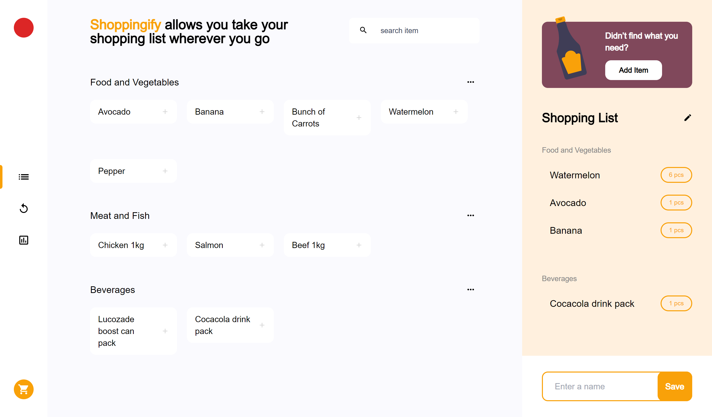
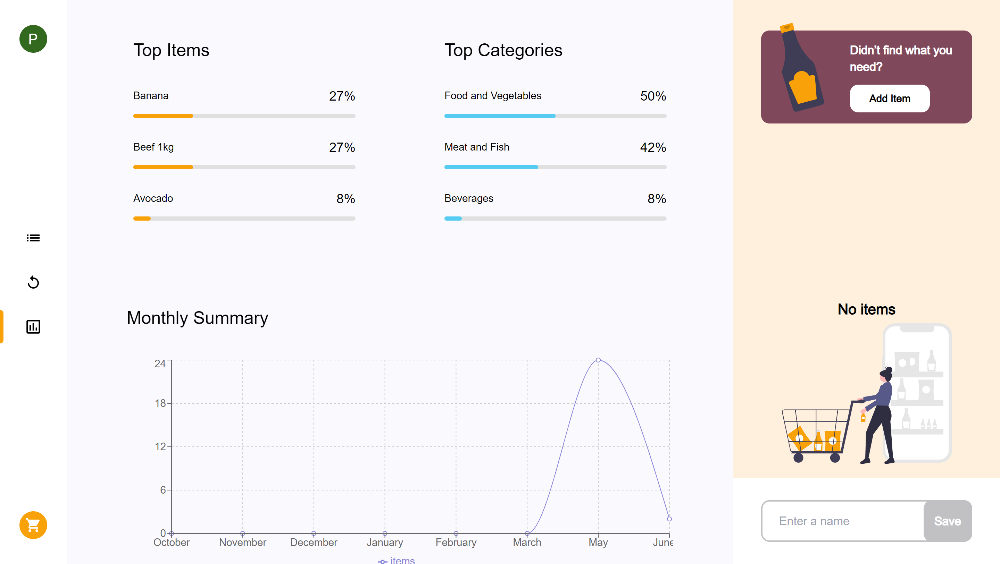
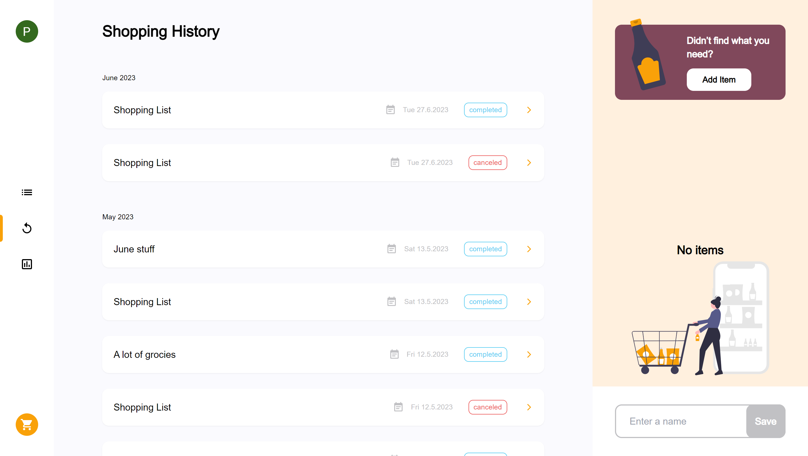

<!-- Please update value in the {}  -->

# Shoppingify

Shoppinify is a web app that allows users to manage their shopping lists, view history of previous shopping lists as well as statistics of their shopping activity

<a href="https://shoppinify.vercel.app">View Demo</a>

<!-- OVERVIEW -->

## Screenshots





### Built With

<!-- This section should list any major frameworks that you built your project using. Here are a few examples.-->

- [Next.js](https://nextjs.org/)
- [Next Auth](https://next-auth.js.org)
- [Prisma](https://www.prisma.io)
- [Mongo DB](https://www.mongodb.com)
- [TailwindCSS](https://tailwindcss.com/)

## Features

<!-- List the features of your application or follow the template. Don't share the figma file here :) -->

- Add and remove items from shopping list
- Group items into categories
- View top items, categories and monthly summary of items bought
- View history of previous shopping lists

## How To Use

<!-- Example: -->

To clone and run this application, you'll need [Git](https://git-scm.com) and [Node.js](https://nodejs.org/en/download/) (which comes with [npm](http://npmjs.com)) installed on your computer. From your command line:

```bash
# Clone this repository
$ git clone https://github.com/peter-abah/your-project-name

# Install dependencies
$ npm install
```

Create an env file and and add the environment variables see `.env.template` for variables to add

```bash
# Run the app
npm run dev
```

Open [http://localhost:3000](http://localhost:3000) with your browser to see the result.

## Acknowledgements

<!-- This section should list any articles or add-ons/plugins that helps you to complete the project. This is optional but it will help you in the future. For example -->

- [React rerender guide](https://www.developerway.com/posts/react-re-renders-guide)

## Contact

- GitHub [@peter-abah](https://{github.com/your-usermame})
- Twitter [@obekpa__](https://{twitter.com/obekpa__})

